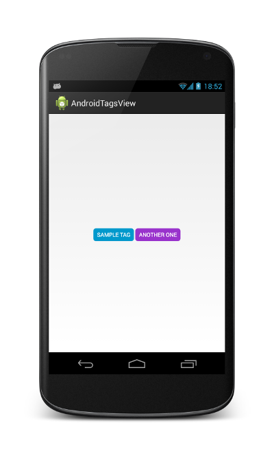

Android TagView
===============

Simple android view to display collection of colorful tags efficiently.

Screenshots
===============



Usage
===============

Basic usage
---------------

Add view to your layout. You can manipulate content with ```setTags``` method.

```
TagView tv = (TagView) getView().findViewById(R.id.tags_view);
TagView.Tag[] tags = {
    new TagView.Tag("Sample tag", Color.parseColor("#0099CC")),
    new TagView.Tag("Another one", Color.parseColor("#9933CC"))
};
tv.setTags(tags, " ");
```

To use default style of TagView, include this attribute in your theme:

```
<item name="tagViewStyle">@style/Widget.TagView</item>
```

Customization
---------------
TagView is derived from TextView, so all it's attributes should work.
Most important ones are ```textSize```, ```textStyle``` and ```textColor```.
Additional view properties are:

* ```tagCornerRadius``` - making corner round
* ```tagPadding``` - adding padding around the tag
* ```tagUppercase``` - making every tag uppercase.

You can override default values using style ```@style/Widget.TagView```
as a parent, to inherit sane default values.

Licence
===============

	Copyright 2013 Michał Charmas

	Licensed under the Apache License, Version 2.0 (the "License");
	you may not use this file except in compliance with the License.
	You may obtain a copy of the License at
	
	http://www.apache.org/licenses/LICENSE-2.0

	Unless required by applicable law or agreed to in writing, software
	distributed under the License is distributed on an "AS IS" BASIS,
	WITHOUT WARRANTIES OR CONDITIONS OF ANY KIND, either express or implied.
	See the License for the specific language governing permissions and
	limitations under the License.


